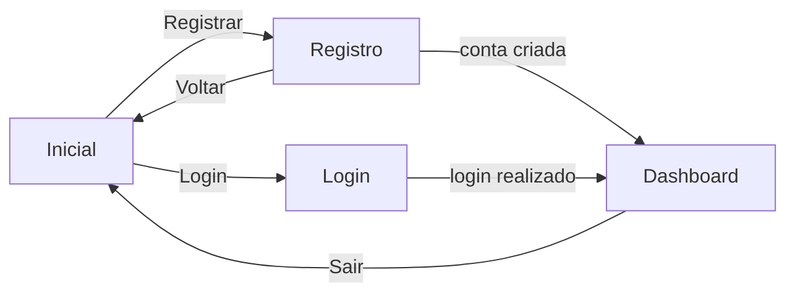
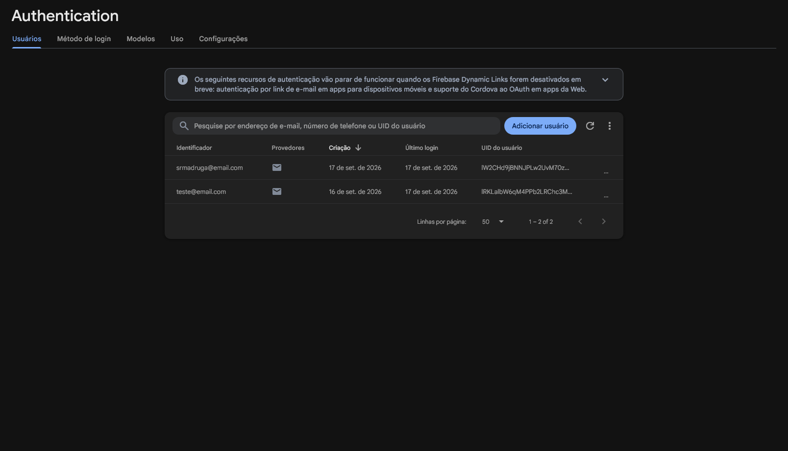

# ProjectDevMob

App Android simples com login e registro usando Firebase Authentication.

## Telas

- **Inicial:** botões para Login e Registrar
- **Registro:** nome, email e senha
- **Login:** email e senha
- **Dashboard:** saudação com o nome do usuário, curiosidades aleatórias e botão para sair

## Fluxo



1. O app abre na tela **Inicial**.
2. No **Registro**, o Firebase cria a conta e salva o nome no perfil do usuário. Depois o app abre o Dashboard, já logado.
3. No **Login**, o Firebase confere email e senha e abre o Dashboard.
4. No **Dashboard**, o botão **Sair** desloga e volta para a tela Inicial.

Ao abrir o Dashboard ou sair dele, as telas anteriores são removidas da pilha. Assim o botão voltar do celular não leva a uma tela que não faz mais sentido.

## Arquitetura

Cada tela é uma `Activity` com o seu layout XML. Não há camadas extras: as próprias Activities chamam o Firebase Authentication.

```
app/src/main/
├── java/br/com/uri/projetodevmob/
│   ├── MainActivity.kt        tela inicial
│   ├── RegisterActivity.kt    cria a conta e salva o nome
│   ├── LoginActivity.kt       faz o login
│   └── DashboardActivity.kt   saudação, curiosidades e logout
├── res/
│   ├── layout/                um layout para cada Activity
│   └── values/                textos, cores, tema e lista de curiosidades
└── AndroidManifest.xml        registro das telas
```

- **Firebase Authentication** guarda os usuários. O nome fica no `displayName` do perfil, sem banco de dados.
- **Navegação** entre as telas com `Intent`.
- **Textos** da interface ficam em `strings.xml`, e as curiosidades em um `string-array`.

### Usuários no Firebase

Contas criadas pela tela de Registro, vistas em **Authentication > Usuários** no console do Firebase:



## Tecnologias

- Kotlin com layouts XML
- Firebase Authentication (email e senha)
- minSdk 36

## Como rodar

1. Clone o repositório e abra no Android Studio.
2. Crie um projeto no [console do Firebase](https://console.firebase.google.com/) e adicione um app Android com o pacote `br.com.uri.projetodevmob`.
3. Baixe o arquivo `google-services.json` e coloque na pasta `app/`. Ele não está no repositório.
4. No console do Firebase, em **Authentication > Método de login**, ative **E-mail/senha**.
5. Sincronize o Gradle e rode o app.
